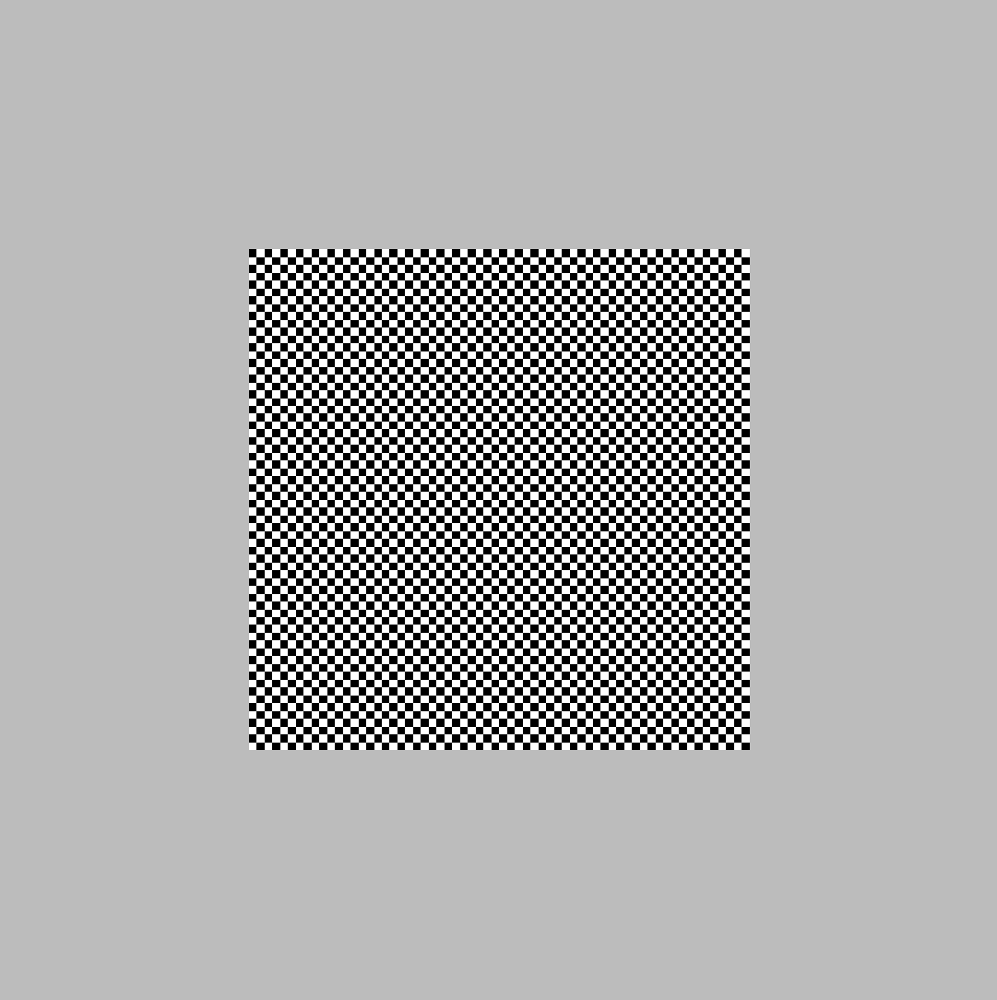
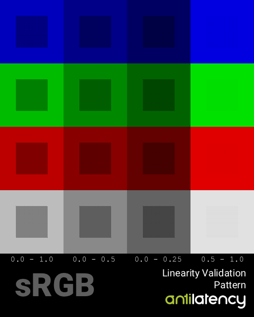

# Display Linearity Validation

Linear behavior of a display device is crucial for any color-critical application, including virtual production. In this article, we will explore how to validate the linearity of a display device using a checkerboard pattern.

## Basics
Display devices assume that input colors are packed in a specific transfer function. The most common transfer function is sRGB.
When display devices receive colors (e.g., via HDMI or DisplayPort), they will remove the transfer function before sending the signal to pixels.

For further explanation, let's simplify things a little bit and assume that our packing function (linear to gamma) is the square root function, which is close enough to sRGB. Our unpacking function (gamma to linear) will be x².
So in order to display a color correctly, we need to send the square root of the desired linear color to the display. Per-component, of course. The display will then apply x² to each component to restore the linear color.

Transfer functions exist to redistribute precision of colors. Since we have only 256 levels per channel (8-bit color), we have to utilize them wisely. Due to the nonlinear nature of human perception of brightness, it is better to have more precision in dark colors than in bright colors. Transfer functions convert linear colors that way, to have smaller steps in dark colors and larger steps in bright colors.

## Pipeline
Unreal Engine (or any other rendering engine) will render linear colors. Before sending them to the display, it will apply the transfer function (e.g., sRGB) to pack colors. So instead of actual color values, the engine will send roughly the square root of those values to the display.
The display will roughly square those values and send them to pixels.

## However!
A display can not only apply a transfer function. It can also apply additional color transforms, such as contrast, saturation, etc. Also, a display may apply another transfer function. For instance, sRGB, Rec709, and Gamma2.2 are very similar, but not identical, so it is impossible to distinguish them visually.

## Validation
It is possible, though, to validate if a display applies the expected transfer function. And we don't even need a colorimeter for that! We can use our eyes and a simple test pattern.

How it works:

We have to check if, for example, 50% gray has exactly half brightness of white. So we prepare a pattern that consists of black and white checkerboard and gray frame around it. Next, we pack those colors using the expected transfer function (e.g. sRGB) and send them to display. So for color value = 0.5, we will send value 188.

*this is a magnified view of one cell of the pattern*

The checkerboard pattern will have an average brightness of 50% because half of the pixels are black and half are white. So if the display applies the correct transfer function, the checkerboard (defocused) should look exactly the same as the gray frame around it.

Instead of black and white, we can use any two colors A and B. The average brightness will be (A+B)/2.
Pattern include multiple tests for different parts of transfer function.
Horizontal rows has 4 tests with different A and B values:

| Checkerboard A | Checkerboard B | Frame (average) |
|----------------|----------------|-------|
| 0.0           | 1.0            | 0.5   |
| 0.0           | 0.5            | 0.25  |
| 0.0           | 0.25           | 0.125 |
| 0.5           | 1.0            | 0.75  |

Also, it is useful to have the same test for individual color channels. So we can have red, green and blue versions of the same pattern.

## Usage

**Very important**: make sure that the pattern is displayed **pixel-perfect**. No scaling!
For instance, you can set this image as desktop wallpaper with "Tile" mode. 

